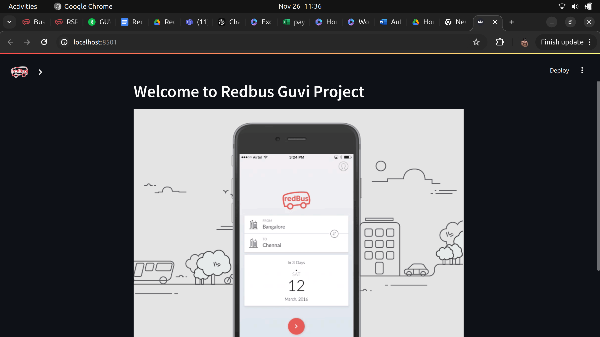
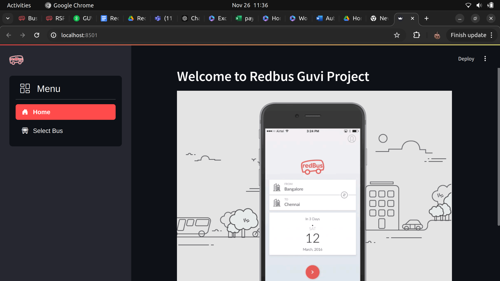
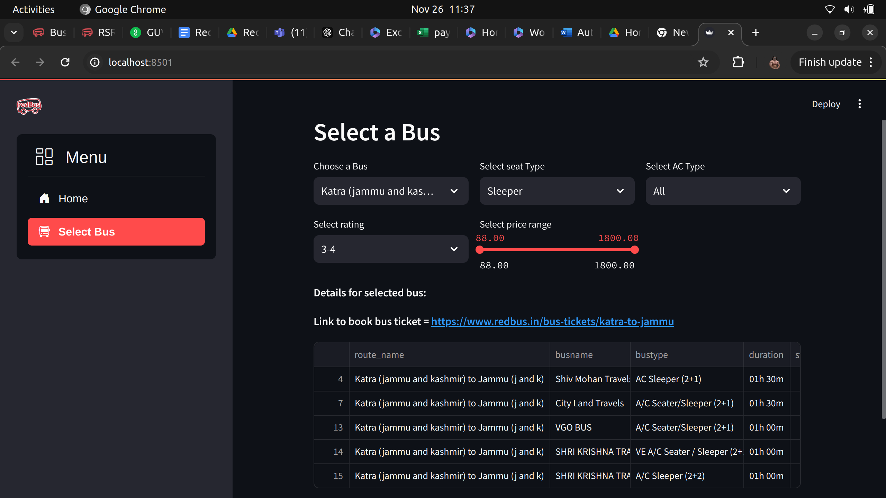

# **Redbus Data Scraping with Selenium and Dynamic Filtering using Streamlit**

This script automates the process of collecting bus route and availability data from the RedBus website using **Selenium** for web scraping and **MySQL** for data storage. The data includes route details, bus information, schedules, fares, and availability, which is stored in a MySQL database for further analysis or use.

---

## **How to Use the Application**

### **1. Home Page**
This is a **Display Page** with a **RedBus animation** that welcomes users to the platform.

### **2. Select Bus Page**
In this page, you can **select the bus route**, **bus type**, **price range**, **star rating**, and whether the bus is **AC** or **Non-AC** to filter the data and get the bus information along with a **link to book** that bus on RedBus.

---

## **Screenshots**

Here are some screenshots to visualize how the application looks:







---

## **Technologies Used**

- **Selenium**: For web scraping and automating the data collection process.
- **MySQL**: For storing collected data securely and efficiently.
- **Streamlit**: For creating the interactive web application with dynamic filtering.
- **Python**: The programming language used to develop the script and web app.

---

## **Installation**

To run this application locally:

1. Clone the repository:
   ```bash
   git clone https://github.com/Ragnor16/Redbus-Guvi-project

2. Run the command:
   ```bash
   streamlit run redbus.py
